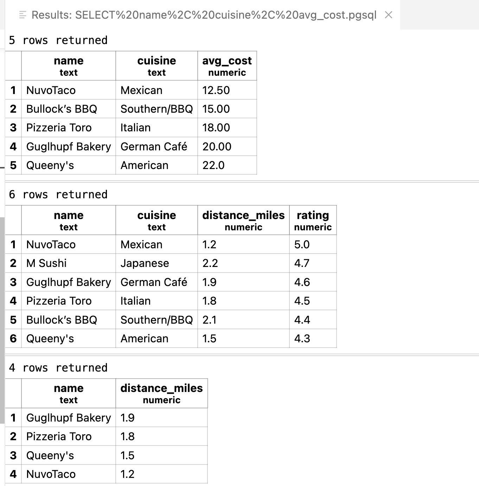
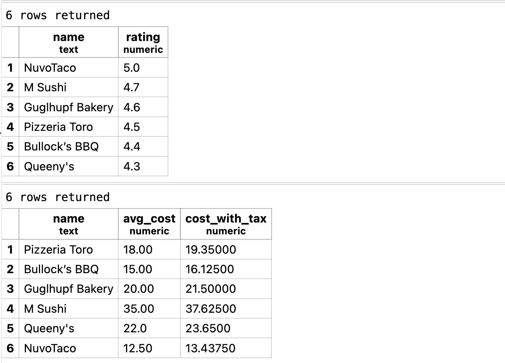
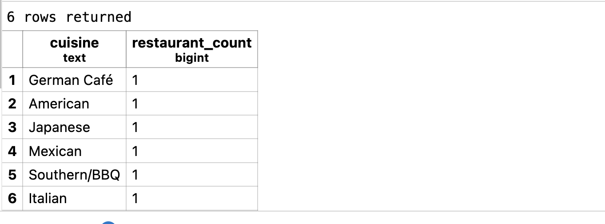

# Week 6 - Demo

The goal for this week is run PostgreSQL in Docker, auto-seed a table, query with `psql`, use the VS Code PostgreSQL Explorer, and run a short Python script.

The following is the SQL code:

```sql
SELECT name, cuisine, avg_cost
FROM restaurants
ORDER BY avg_cost ASC
LIMIT 5;

SELECT name, cuisine, distance_miles, rating
FROM restaurants
WHERE distance_miles <= 5 AND rating >= 4.0
ORDER BY rating DESC, distance_miles ASC;

-- Return name, distance_miles for restaurants within 2.0 miles, ordered by distance.
-- Show the top 3 restaurants by rating (highest first).
-- List name, avg_cost and cost with 7.5% tax as cost_with_tax.
-- How many restaurants are there per cuisine, highest count first?

SELECT name, distance_miles
FROM restaurants
WHERE distance_miles <= 2.0
ORDER BY distance_miles DESC;

SELECT name, rating
FROM restaurants
ORDER BY rating DESC;

SELECT *
FROM restaurants;

SELECT 
    name, 
    avg_cost,  
    avg_cost * 1.075 AS cost_with_tax
FROM restaurants;

SELECT 
    cuisine, 
    COUNT(*) AS restaurant_count
FROM 
    restaurants
GROUP BY 
    cuisine
ORDER BY 
    restaurant_count DESC;
```

The output of SQL query code is:







